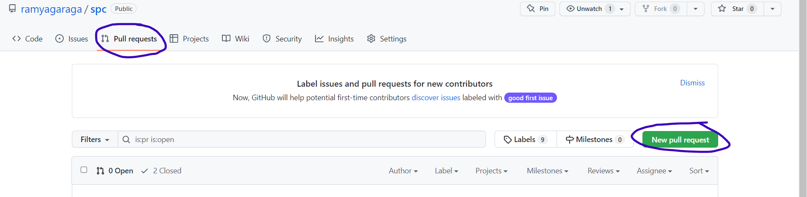
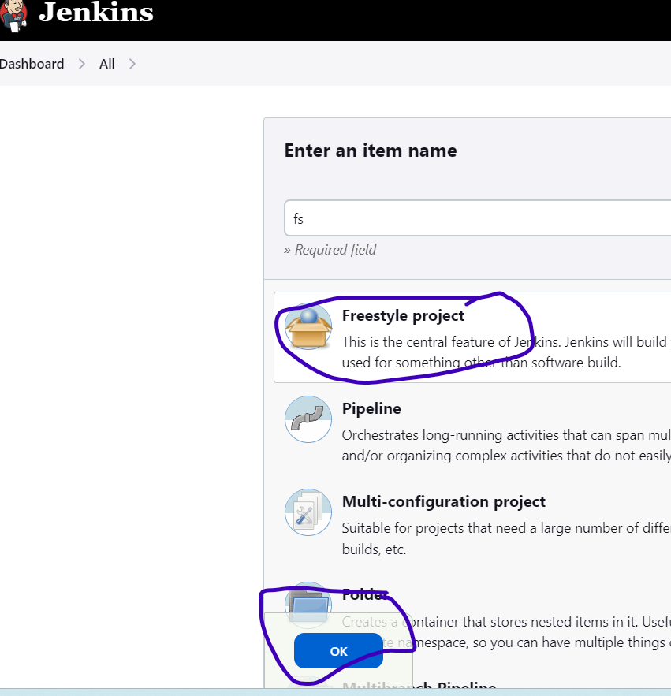

# spring pet clinic
----------------------

## Manual steps :
 * git clone https://github.com/ramyagaraga/spc.git 
 * cd spc 
 * mvn package
 * java -jar target/*.jar 
  
## freestyle method :
  * take spc github project and fork the repository create feature branch in your repository 
  * write a jenkins pipeline for spring petclinic project in feature branch 
  * if any changes are done then send a pull request to main branch then admin of that repository can accept your request instead of merging they check and run your pipeline after that only they merge 
  ```pipeline {
    agent { label 'buildnode'} 
    stages {
        stage('vcs') { 
            steps {
                git url: 'https://github.com/ramyagaraga/spc.git',
                    branch: 'develop'

            }
        }
        stage('Build') { 
            steps {
                sh 'mvn package'
            } 
        } 
        stage('sonal analysis') {
            steps {  
                withSonarQubeEnv('sonar') {
                    sh 'mvn clean package sonar:sonar -Dsonar.login=58bc2abae0cef588fc418f417846217978e143b5 -Dsonar.organization=prspring -Dsonar.projectKey=prspring_spring'
                } 
            }
        } 
    }
}

```
* send pull request to main repository 

* take master vm and install java , maven & jenkins
* for jenkins installtion  [refer here ](https://www.jenkins.io/doc/book/installing/linux/)
* ` sudo cat`
* after login into jenkins create a freestyle project 

* click on Manage jenkins  &rarr;  Manage Credentials and give credentials for node
* give a connection between github and jenkins through credentials with github token
for that generate a token in github
*  go to settings in github &rarr; developer settings &rarr; personal access token  &rarr; `generate token` 
* by using this token add credetials in jenkins 
* now configure the project by givinig required details 
  * create a pull request in git hub 
  * ensure once it automatically trigger in jenkins (it will not trigger)
  * goto manage jenkins &rarr; manage pluggins &rarr; install GitHub Pull Request Builder 
  * follow this documetation for git pull request in jenkins [referhere](https://plugins.jenkins.io/ghprb/) [referhere](https://devopscube.com/jenkins-build-trigger-github-pull-request/)
## webhooks : 
* Webhooks allow external services to be notified when certain events happen 
* it is used to trigger the github events in jenkins for that go to settings in git hub repository click on webhooks `add webhook` give jenkins url and select git hub pull_request 
* send a pull request in github it will automatically trigger in jenkins 
* if it is success then merge the request 

## Multibranch Pipeline : 
  * In multi branch pipeline all branches in your repository will run automatically 
  * Create two branches develop and release 
  * In develop branch write a declarative pipeline for build the project 
  * build the project by using `mvn package` command  
  ```
  pipeline {
    agent { label 'buildnode'} 
    stages {
        stage('vcs') { 
            steps {
                git url: 'https://github.com/ramyagaraga/spc.git',
                    branch: 'develop'

            }
        }
        stage('Build') { 
            steps {
                sh 'mvn package'
            } 
        } 
        stage('sonal analysis') {
            steps {  
                withSonarQubeEnv('sonar') {
                    sh 'mvn clean package sonar:sonar -Dsonar.login=58bc2abae0cef588fc418f417846217978e143b5 -Dsonar.organization=prspring -Dsonar.projectKey=prspring_spring'
                } 
            }
        } 
    }
}

  ```
  * In release pipeline write a declarative pipeline for deployment of project 
  * deploy the project by using `java -jar target/*.jar ` 
  ```
  pipeline {
    agent { label 'buildnode'} 
    triggers { pollSCM ('* 23 * * *') } 
    parameters {
        choice(name: 'MAVEN_GOAL', choices: ['package', 'install', 'clean'], description: 'Maven Goal')
    }
    stages {
        stage('vcs') { 
            steps {
                git url: 'https://github.com/ramyagaraga/spc.git',
                    branch: 'release'

            }
        }
        stage('Build') { 
            steps {
                sh 'mvn package'
            }
        } 
        stage('sonal analysis') {
            steps {  
                withSonarQubeEnv('sonar') {
                    sh 'mvn clean package sonar:sonar -Dsonar.login=58bc2abae0cef588fc418f417846217978e143b5 -Dsonar.organization=prspring -Dsonar.projectKey=prspring_spring'
                     } 

            }
        } 
        stage('post build') {
            steps {
                archiveArtifacts artifacts: '**/target/spring-petclinic-3.0.0-SNAPSHOT.jar',
                                 onlyIfSuccessful: true 
                junit testResults: '**/surefire-reports/TEST-*.xml' 
                stash includes: '**/target/spring-petclinic-3.0.0-SNAPSHOT.jar', name: 'jarfile'
                      
            }
        }
        stage('get jarfile') {
            agent { label 'deploymentnode'}
            steps {
                unstash name: 'jarfile'
            }
        }
        stage('deployement') { 
            agent { label 'deploymentnode' }
            steps { 
               sh 'ansible-playbook -i hosts spc.yml'
            }
        }
    }
}
  ```
  * now here we have do build in one node and deployment in another vm for that we use `stash & unstash`  
    * stash is copying the files  
  * for deployment purpose write a service file to project 
```
  [Unit]
Description=spc 

[Service]
ExecStart=/usr/lib/jvm/java-1.17.0-openjdk-amd64/bin/java -jar /tmp/spring-petclinic-3.0.0-SNAPSHOT.jar

[Install]
WantedBy=multi-user.target 
```
* Create user in another node Install ansible [referhere](https://www.digitalocean.com/community/tutorials/how-to-install-and-configure-ansible-on-ubuntu-22-04)
* `sudo vi /etc/ssh/sshd_config`
* `sudo vi /etc/sudoers` 
* ` sudo systemctl restart sshd`
* `su jenkins`
* `ssh-keygen`
* `ssh-copy-id <node private ip>`
* write a ansible playbook for service file 
```
--- 
- name: spring pet clinic 
  hosts: all 
  become: true 
  tasks: 
    - name: copy the spc jar file 
      ansible.builtin.copy: 
        src: /home/jenkins/root/workspace/spc_release/target/spring-petclinic-3.0.0-SNAPSHOT.jar 
        remote_src: true
        dest: /tmp/ 
    - name: copy the unit service file
      ansible.builtin.copy: 
        src: spc.service 
        dest: /etc/systemd/system/spc.service 
    - name: file permissions 
      ansible.builtin.file: 
        path: /etc/systemd/system/spc.service 
        mode: '664'
        state: file 
    - name: service file 
      ansible.builtin.systemd: 
        daemon_reload: true 
        enabled: true 
        name: spc.service 
        state: started
```
* now node private ip added in inventory file `vi hosts` 
* these all playbook and hosts file service file all are kept in release branch 
* run the multibranch pipeline then get the output